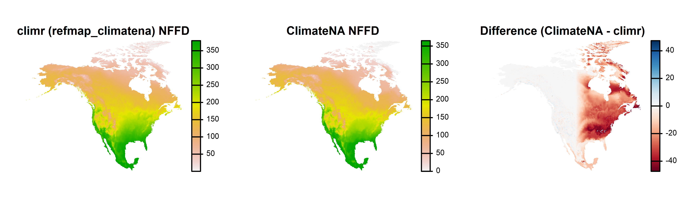
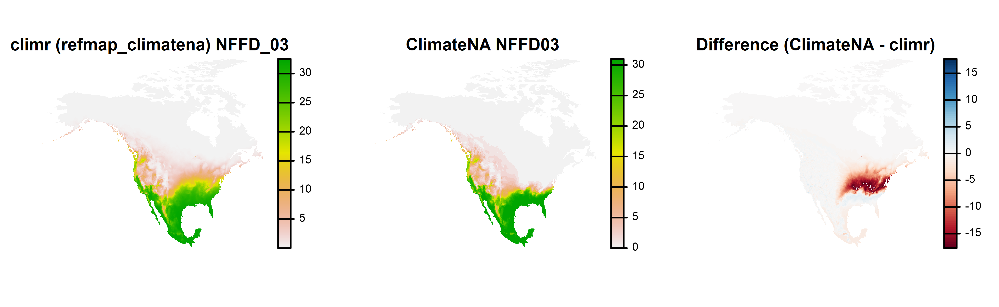
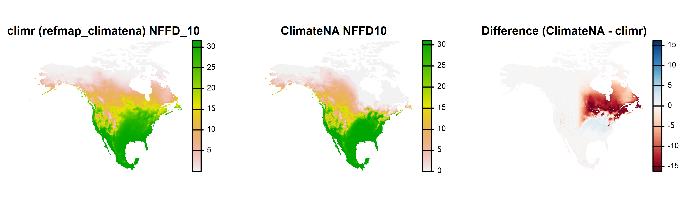
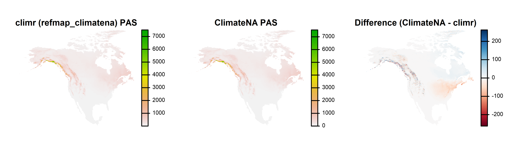
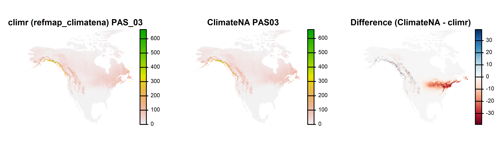
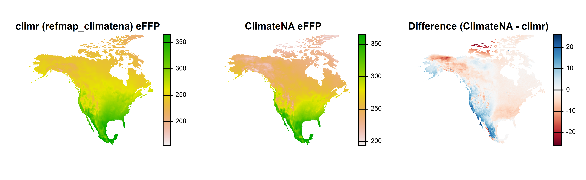
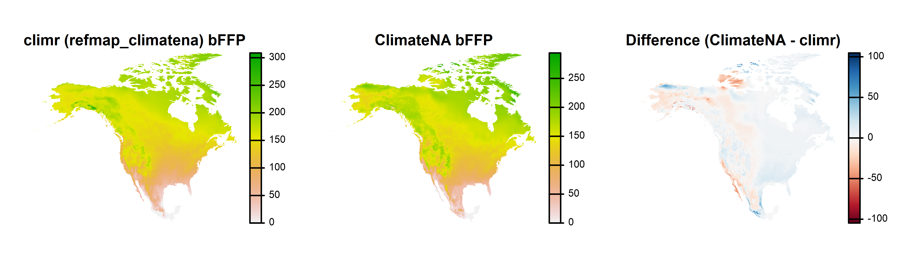
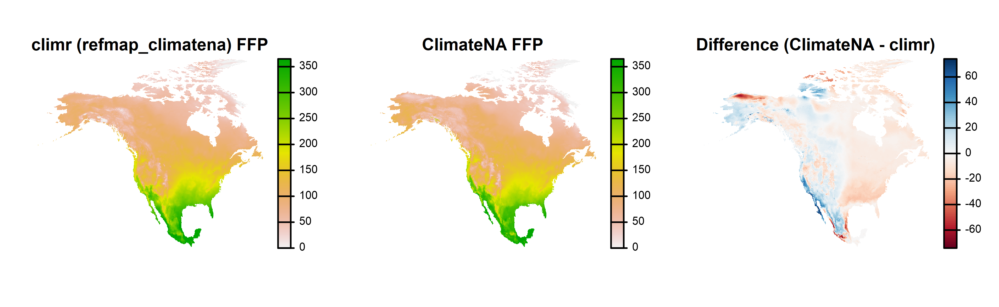
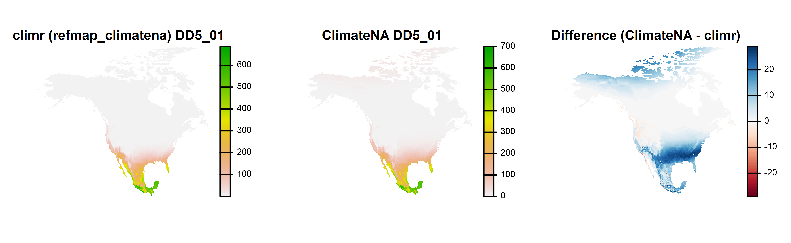

`climr` currently uses the ClimateNA derived variable equations [@wang2016]. In theory, we should get similar results from both packages when we use the `refmap_climatena` as the downscaling basemaps for climr. However, there are unexplained discrepances in some variables. 

### NFFD and PAS

We have obtained updated parameters for number of frost free days (NFFD) and precipitation-as-snow (PAS) from the ClimateNA developers. However, there are still discrepancies between `climr` results using refmap_climatena and results from the ClimateNA product. 

Annual NFFD has discrepancies across eastern North America. 

{width=100%}

Monthly NFFD is confined to latitudinal bands within eastern North America. Note that ClimateNA has a very sharp monthly NFFD gradient in Eastern North America. 

{width=100%}
{width=100%}

The pattern is similar for PAS. Differences in western North America are likely due our choice to disable elevation adjustment for precipitation in `climr` 

{width=100%}
{width=100%}

It is likely that ClimateNA is using different parameters in eastern North America. We have chosen not to pursue this issue because we are planning to develop new derived variable equations for `climr` within the next year. 

### Frost-free period (FFP) variables

climr and ClimateNA have substantial discrepancies in the end day of the frost-free period (eFFP), commonly on the order of 10 days, though both have credible gradients at the continental scale. Since there are no discrepancies in monthly mean minimum temperatures, these discrepancies must be due to differences in the derived variable equation parameters. However, we have not pursued this issue. 

{width=100%}
{width=100%}
{width=100%}

### Growing degree-days (DD5) 

ClimateNA has positive values of DD5 in the high arctic in the winter months, which does not seem credible. For example, ClimateNA indicates DD5 up to 20 growing degree days in January. Since the climr values are more credible, we have not pursued this issue. However, apparently climr and ClimateNA are using different parameters for degree-day variables. 

{width=100%}

#### References
