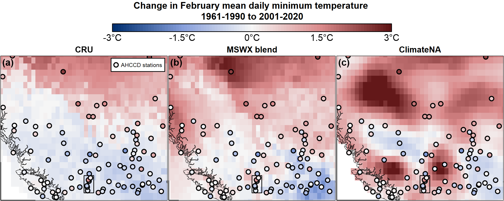

A gridded observational time series is a dataset that organizes real-world measurements into a regular latitude-longitude grid and tracks changes over time. Observations from sources like weather stations and satellites are collected and assigned to these grid cells, using interpolation for grid cells that do not have a direct observation. For each grid cell, the dataset provides a continuous record of a variable — such as temperature or precipitation — over regular daily or monthly timesteps. The intent of gridded time series is to allow researchers to analyze both spatial patterns and temporal trends across large areas, even in locations without direct observations. 

`climr` provides access to three observational time series datasets of temperature and precipitation: 

1.	`cru.gpcc`: The 1901-2023 combined Climatic Research Unit TS dataset (CRU; @harris2020cruts) for temperature and Global Precipitation Climatology Centre dataset (GPCC; @becker2013gpcc) for precipitation; 
2.	`mswx.blend`: The 1981-2024 Multi-Source Weather (MSWX; @beck2022mswx) for temperature and Multi-Source Weighted-Ensemble Precipitation (MSWEP; @beck2019mswep) for precipitation, which we have extended back to 1901 using the CRU/GPCC dataset; and 
3.	`climatena`: The 1901-2023 ClimateNA time series (@wang2024monthly). 

Our aim in this article is provide a better understanding of these datasets, including their strengths and weaknesses. 

### Why are multiple observational datasets necessary? 

Observations of historical weather are limited to data from (1) climate stations, which are very sparse in many areas of North America, and (2) modeled reconstructions (“reanalysis”) of historical weather systems, which have multiple sources of bias. As a result, there is considerable uncertainty about the past weather, and this uncertainty varies across the landscape depending on proximity to where observations were made. By analyzing multiple datasets with different methods and input data, we can better understand the uncertainties in our variables and locations of interest. Further, each dataset may be optimal for different applications. Finally, providing multiple datasets allows `climr` output to be benchmarked against other studies that are based on those products. 

### Dataset descriptions

#### CRU/GPCC

The Climatic Research Unit TS dataset uses angular distance weighting to interpolate monthly weather station anomalies (deviations from a long-term average). It is the only global gridded station time series product that provides monthly mean minimum and maximum daily temperature (Tmin and Tmax) for the entire 20th century. As a result, it is very widely used in climate research. While CRU provides precipitation data, independent research (@sun2018review) and our own analysis indicate that GPCC has higher performance in representing historical precipitation. A significant weakness of both the CRU and GPCC time series dataset is a dramatic decline in the number of stations contributing to the datasets at the end of the 1990s ([Figure 1](#fig1)). 

<div id="fig1">
```{r, echo=FALSE, fig.cap = "Figure 1: Changes in the number of stations contributing to the CRU gridded minimum and maximum temperature products (a) and the GPCC precipitation product (b).", results='asis', out.width = "100%"}
knitr::include_graphics("plots_timeseries/StationCounts_CRU.png")
```
</div>

#### ClimateNA

The 21st century station sparsity of the CRU and GPCC datasets ([Figure 1](#fig1)) motivated the development of the ClimateNA gridded monthly historical time series for North America (@wang2024monthly). This product uses thin-plate splines to interpolate between weather station observations. The North American station count from 1961-present is maintained at above n=6000 for temperature and n=8000 for precipitation. Hence, the ClimateNA time series do not suffer from degradation post-1990 due to declining station density as seen in CRU and GPCC. 

#### MSWX blend

MSWX provides an entirely different approach to gridded observational time series. Instead of interpolating between weather stations, it applies bias correction to the hourly ERA5 reanalysis (i.e., an observationally constrained weather model simulation) for the period 1979-present. The bias correction is performed using monthly climatologies (30-year averages) obtained from the CHELSA product. For precipitation, we use MSWEP, which merges multiple data sources including rain gauge, satellite, reanalysis, and river discharge data. We blended the MSWX/MSWEP time series with the CRU/GPCC time series to produce a 1901-2024 time series and to allow calculation of MSWX anomalies relative to the 1961-1990 baseline used in climr. The blend occurs in the 1990s; hence the `mswx_blend` product is CRU/GPCC prior to 1990, MSWX/MSWEP post-1997, and a weighted average from 1990-1997. 

### Intercomparison of datasets

The three datasets have distinct spatial patterns of anomalies, exemplified by their 2001-2020 average Tmin anomalies across North America ([Figure 2](#fig2)). CRU anomalies vary at large spatial scales due to the broad spatial influence of each station in the distance weighting method.  In contrast, the MSWX blend exhibits localized anomalies that follow physiographic features such as the MacKenzie Mountains in southern Yukon, the Great Lakes, and the coastal fringe in the Pacific Northwest. This link to physiographic features is an outcome of using a physical weather model as the basis for MSWX. Finally, the ClimateNA time series exhibits credible spatial detail in station-dense United States, but also has spatial oscillations in station-sparse western and northern Canada that may be artefacts of the thin-plate spline method of interpolation between stations. 

<div id="fig2">
```{r, echo=FALSE, fig.cap = "Figure 2: Comparison of the CRU, MSWX-blend, and ClimateNA gridded time series in terms of the difference between the 1961-1990 and 2001-2020 average February Tmin.", results='asis', out.width = "100%"}
knitr::include_graphics("plots_timeseries/CRUvsMSWXvsClimateNA_3Panel_30arcminute.Tmin.02.png")
```
</div>

The general difference between datasets noted in [Figure 2](#fig2) are also evident in Tmax anomalies and different months ([Figure 3a](#fig3)). Specifically: the higher spatial detail of the MSWX-blend and climateNA time series; and the apparent interpolation artefacts in station-sparse regions of the climateNA time series, most visible in Central Mexico. 

For precipitation, the three products indicate similar trends at a very coarse contintental scale, but there are  substantial differences between the precipitation trends at regional scales ([Figure 3b](#fig3)). MSWX-blend has the highest spatial detail and appears generally credible. It also exhibits the strongest trends, with adjacent 20-year anomalies of a factor of two (-50%, +100%) in the arctic. These strong contrasting trends may be artefacts, but we have not yet investigated their credibility. 

<div id="fig3">
```{r, echo=FALSE, fig.cap = "Figure 3: As in Figure 2, but for Tmax and precipitation of January, April, July, and October.", results='asis', out.width = "100%"}
knitr::include_graphics("plots_timeseries/CRUvsMSWXvsClimateNA_Diffplots.png")
```
</div>

The striking differences between the three products are further evident in [Figure 4](#fig4), which shows 1961-2020 February Tmin trends in British Columbia and Alberta. The quality-controlled station records from the Adjusted and Homogenized Canadian Climate Data (@vincent2020ahccd) are provided for reference. The CRU time series indicates a moderate cooling across northern BC while the MSWX blend indicates a moderate warming; both trends are stronger than the relatively neutral station trends. The ClimateNA product has strongly contrasting warming and cooling trends that are not supported by the AHCCD stations. We have not yet established whether this pattern is due to non-AHCCD stations or is an artefact of the spline interpolation in areas with no stations. The variation among the stations themselves indicates the significant uncertainty in determining regional climate change trends. 

<div id="fig4">
```{r, echo=FALSE, fig.cap = "Figure 4: As in figure 2, but zoomed into the region of British Columbia and Alberta. Filled circles are AHCCD stations and follow the same color scheme as the gridded data. The black rectangle at lower centre of each map is a region of the Okanagan Valley featured in Figures 5 and 6. ", results='asis', out.width = "100%"}

```
</div>

The Okanagan Valley (outlined with the black rectangle in [Figure 4](#fig4)) has a high density of AHCCD stations that help to put the differences between the gridded products into context. The CRU and ClimateNA time series are very similar during the 20th century, but diverge in 1998 coincident with the sharp decline in CRU station density ([Figure 5](#fig5)). This divergence produces a slight cooling trend in CRU and a slight warming trend in ClimateNA. The 6 AHCCD stations corroborate the CRU trend, as indicated by the boxplot. However, the year-to-year variability is much greater than the difference in the trends, and is synchronous between the products. 

<div id="fig5">
```{r, echo=FALSE, fig.cap = "Figure 5: Comparison of the ClimateNA, MSWX blend, and CRU February Tmin time series for the Okanagan Valley study area mapped in Figure 5. Solid grey lines are the station records for the six AHCCD stations located in the study area. Dashed lines are the 2001-2020 mean of each time series. The boxplot shows the distribution of the AHCCD station 2001-2020 means.", results='asis', out.width = "100%"}
knitr::include_graphics("plots_timeseries/CRUvsClimateNA_ts.Tmin.02.png")
```
</div>

The July temperature time series is instructive ([Figure 6](#fig6)). The post-1998 divergence of the products is much greater relative to natural variability. Unlike in February, the CRU trend is below the distribution of AHCCD station trends. This example illustrates that the differences between products is not trivial and could have substantial implications both for trend detection and analysis of interannual variation. The February and July examples illustrate that one product doesn't necessarily provide a consistently more reliable trend, even in station-dense regions.

<div id="fig6">
```{r, echo=FALSE, fig.cap = "Figure 6: As in Figure 5, but for July Tmin. ", results='asis', out.width = "100%"}
knitr::include_graphics("plots_timeseries/CRUvsClimateNA_ts.Tmin.07.png")
```
</div>

To assess the general reliability of the gridded products, we assessed error in the 2001-2020 mean temperature anomalies relative to the AHCCD stations across western Canada (west of -100^o^E, including the Arctic region)([Figure 7](#fig7)). The limitation of this approach is that it favours station based products (CRU and ClimateNA) because they use some or all AHCCD stations as input data. Further, this assessment doesn't provide insights on the quality of interpolation between stations. 

CRU consistently has the lowest range of error, but it consistently has a median error below zero indicating that on average CRU underestimates the climate change trend in both Tmin and Tmax. ClimateNA overestimates the trend in non-summer Tmin and underestimates the trend in summer Tmax. Across all months, the MSWX blend has the least bias in trend, though ClimateNA also has low bias in Tmax. 

<div id="fig7">
```{r, echo=FALSE, fig.cap = "Figure 7: Error (relative to AHCCD stations) in 2001-2020 average anomaly from the 1961-1990 baseline, for monthly mean of daily minimum and maximum temperature. The study area is western Canada, west of -100^o^E, including the Arctic region Each box-and-whisker plot shows the minimum, 25th percentile, median, 75th percentile, and maximum of the distribution.", results='asis', out.width = "100%"}
knitr::include_graphics("plots_timeseries/Boxplots_AHCCD_Wcan.png")
```
</div>

The results across western Canada suggest that the MSWX blend has lower bias than the other two products. However, results for individual provinces indicates that this lower bias is not consistent among regions ([Figure 8](#fig8)). There is no consistently preferable product across regions and months, in terms of trend error relative to AHCCD stations. Again, this is a narrow comparison that inherently favours CRU and ClimateNA.

<div id="fig8">
```{r, echo=FALSE, fig.cap = "Figure 8: As in Figure 7, but Tmin error of (a) British Columbia, (b) Alberta, and (c) Saskatchewan. ", results='asis', out.width = "100%"}
knitr::include_graphics("plots_timeseries/Boxplots_AHCCD_provinces.Tmin.png")
```
</div>


### Conclusions

This cursory analysis has not identified a clear winner among gridded observational time series. CRU/GPCC are compromised by the post-1990s decline in station density, while ClimateNA exhibits apparent interpolation artefacts with large impacts on the detected climate change trend. the MSWX blend produces credible trends for temperature and precipitation, but has likely artefacts in precipitation trends in the arctic. The MSWX blend is the most conceptually appealing approach to gridded time series because the gridpoints without station observations are informed by physical weather modeling. However, a more detailed validation would be required to establish MSWX as a preferred product. In the meantime, we are using the MSWX-blend for the 2001-2020 observed normals (`obs_periods = "2001_2020") as well as for transferring the 1981-2010 climr climatological mosaic to the 1961-1990 baseline period. 

Some further considerations for users of gridded time series in `climr`: 

- None of the products are reliable for detection of climate change trends. Where possible, it is preferable to use quality-controlled station data such as AHCCD (@vincent2020ahccd) for trend analysis. We intend to include AHCCD station data in a future version of climr. Where gridded observational time series are used, it is a good practice to include all three datasets as a (crude) way of representing uncertainty. 

- The blending of MSWX with CRU/GPCC is necessary because climr uses a 1961-1990 baseline, while MSWX is only available for 1979 to present. Nevertheless, this blending likely contaminates the MSWX time series with artefacts from the CRU time series. We will investigate better ways of integrating reanalysis time series into climr. 

- The differences between the datasets are most salient for trend detection. In noisy variables such as precipitation and winter temperatures, interannual climatic variability appears to be generally synchronous and much greater than the trend. 

### References

