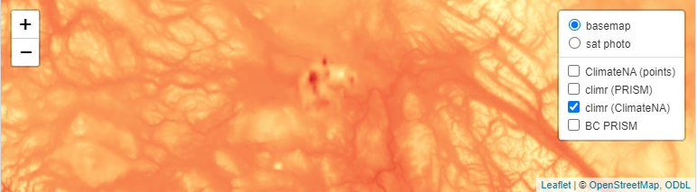
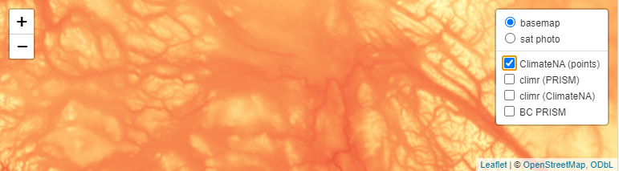

There is a spatial anomaly in the `refmap_climatena` climatologies near Prince George, BC. This appears to be due to our use of the raster output from climateNA as the climr input data. We will fix this in the database ASAP. 

climr output using refmap_climatena (March Tmax):

{width=100%}

Point query output direct from ClimateNA:

{width=100%}

