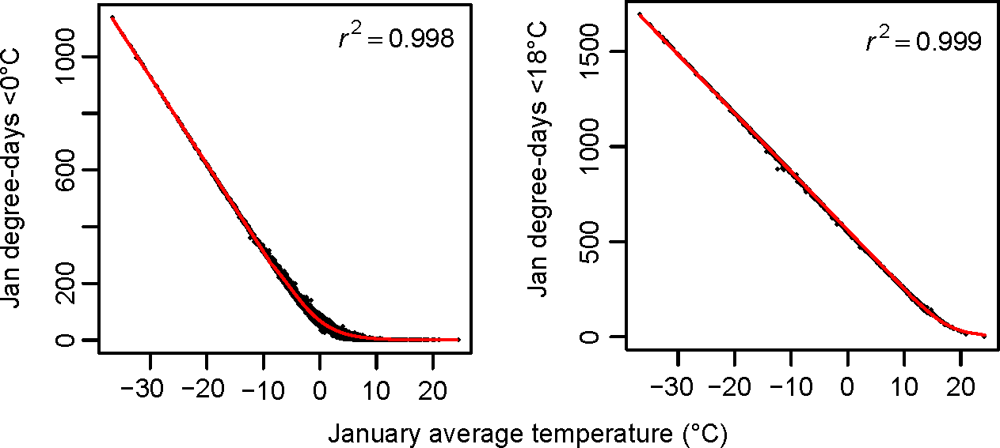

```{r, include = TRUE, echo = FALSE}
knitr::opts_chunk$set(
  collapse = TRUE,
  comment = "#>"
)
```

```{r, include = TRUE, echo = FALSE}
library(climr)
library(terra)
library(RColorBrewer)
dbCon <- data_connect()
bdy <- vect("../data-raw/Coast_Vancouver.shp")
```

# `climr` downscaling methods

Downscaling is the process of converting low-spatial-resolution climate data to high resolution. `climr` adapts a downscaling approach originally implemented in [ClimateNA](https://climatena.ca/) [(Wang et al. 2016)](https://journals.plos.org/plosone/article?id=10.1371/journal.pone.0156720) by Dr. Tongli Wang (University of British Columbia), Dr. Andreas Hamann (University of Alberta), and Dave Spittlehouse (BC Ministry of Forests). This approach downscales climate data in three stages:

1.  *Change-factor downscaling* of coarse-resolution (50-200km grid) monthly temperature and precipitation data from climate models or observational sources to high-resolution (1-4km grid);
2.  *Elevation adjustment* of temperature variables to provide scales finer than the high-resolution reference grid; and
3.  *Calculating derived variables* from the monthly temperature and precipitation variables.

### Stage 1: change-factor (aka "delta") downscaling

`climr` uses a simple method called change-factor downscaling. This method is sometimes referred to as the climate imprint method [(Hunter and Meentemeyer 2005)](https://journals.ametsoc.org/view/journals/apme/44/10/jam2295.1.xml), the delta method [(Wang et al. 2016)](https://journals.plos.org/plosone/article?id=10.1371/journal.pone.0156720), or simple mean bias correction [(Maraun 2016)](https://link.springer.com/article/10.1007/s40641-016-0050-x). This method adds low-spatial-resolution anomalies (e.g., from a climate model) to a high-resolution gridded climate map (Tabor and Williams 2010). While change-factor downscaling is too simplistic for downscaling of daily time series or extremes indices, it is sufficient for downscaling temperature and precipitation data at low temporal resolution (e.g., 20-year climate averages).

The default high-resolution climate maps used by `climr` are 800m gridded maps of mean daily maximum temperature (T~max~), mean daily minimum temperature (T~min~), and precipitation (PPT). There is one map for each month of the year, for a total of 36 climate maps. Here is what the July T~max~ reference map looks like in the vicinity of Vancouver, BC.

```{r, include = TRUE, echo = FALSE}
studyarea <- ext(c(-124, -120, 49, 50.5))
thebb <- rev(as.vector(studyarea)) #this is a patch until we fix the get_bb() and normal_input() function
refNormals <- normal_input(dbCon = dbCon, normal = "composite_normal", bbox = thebb, cache = TRUE) 
breaks=seq(7,33,0.1)
plot(refNormals$Tmax07, col=colorRampPalette(rev(brewer.pal(11, "RdYlBu")))(length(breaks)-1), breaks=breaks, type="continuous", ext=studyarea)
plot(bdy, add=T)
```

Global climate model data are at much lower resolution (60-200km grid scale). Here is the change in July Tmax for the EC-Earth3 global climate model for the 2041-2060 time period, relative to the model's 1961-1990 climate. In this case, the warming is greater in areas further (eastward) from the coast.

```{r, include = TRUE, echo = FALSE}
gcm <- gcm_input(dbCon, bbox = thebb, 
                 gcm = c("EC-Earth3"), 
                 ssp = c("ssp245"), 
                 period = "2041_2060",
                 max_run = 0,
                 cache = TRUE)
gcm_example <- gcm$`EC-Earth3`[[grep("Tmax_07", names(gcm$`EC-Earth3`))]] # TODO need to figure out how to better call the gcm raster
plot(gcm_example, col=colorRampPalette(rev(brewer.pal(11, "RdYlBu")))(99), ext=studyarea)
plot(bdy, add=T)
```

To downscale the GCM projection, we first interpolate the low-resolution GCM anomaly (in this case, the temperature change from 1961-1990 to 2041-2060) to the resolution of the detailed reference climate map:

```{r, include = TRUE, echo = FALSE}
gcm_example_interp <- project(gcm_example, refNormals, method="bilinear")
plot(gcm_example_interp, col=colorRampPalette(rev(brewer.pal(11, "RdYlBu")))(99), ext=studyarea)
plot(bdy, add=T)
```

Then we add these smoothed anomalies to the high-resolution 1961-1990 climate map.

```{r, include = TRUE, echo = FALSE}
gcm_example_downscaled <- refNormals$Tmax07 + gcm_example_interp
plot(gcm_example_downscaled, col=colorRampPalette(rev(brewer.pal(11, "RdYlBu")))(length(breaks)-1), breaks=breaks, type="continuous", ext=studyarea) #TODO scale this color ramp the same as the refnormals map above. 
plot(bdy, add=T)
```

In the case of precipitation we multiply the reference climate by the relative anomaly (e.g., multiply by 1.07 for a 7% increase in precipitation), rather than adding the absolute anomaly.

### Stage 2: Elevation adjustment

`climr` uses elevation adjustment to downscale temperature variables at scales finer than the resolution of the reference climate map. The local lapse rate is calculated for each grid cell of the reference climate map using a linear regression of temperature to elevation among the focal cell and its 8 neighbours. The lapse rates are included in the `SpatRaster` returned by the `normal_input()` function used above:

```{r, include = TRUE, echo = FALSE}
lapse <- crop(refNormals$lr_Tmax07, studyarea)
lapse[abs(values(lapse))>quantile(abs(values(lapse)), 0.995, na.rm=T)] <- quantile(abs(values(lapse)), 0.99, na.rm=T)
plot(lapse, col=colorRampPalette(rev(brewer.pal(11, "RdYlBu")))(99))
plot(bdy, add=T)
```

This example indicates that the BC PRISM maps for July Tmax have lower lapse rates in maritime influenced mountains (4C/km) than in mountains with less maritime influence (8C/km). The map of lapse rates has artefacts in areas with no relief; these artefacts have no consequence unless users supply elevations for these areas that deviate substantially from realistic ground elevations in areas of flat topography.

We can use the `climr_downscale()` function with a 90m Digital elevation model (DEM) to illustrate the elevation adjustment. First, we import the DEM and convert it into raster input.

```{r, include = F, echo = FALSE, figures-side, fig.show="hold", out.width="50%"}
dem_aoi <- rast("../data-raw/example_VanNorthShore.tif") ## get the sample DEM for the North Shore of Vancouver 
points_dat <- as.data.frame(dem_aoi, cells=T, xy=T) # convert dem cells to data frame
colnames(points_dat) <- c("id", "x", "y", "el") # rename the columns to standard climr format
points_dat <- points_dat[,c(2,3,4,1)] #restructure for climr input
```

Then we use `climr_downscale` to generate July Tmin data for the study area. We're including some GCM output and extra variables to use in the next section.

```{r, include = F, echo = FALSE}
clim.aoi <- climr_downscale(points_dat,
                        which_normal = "composite_normal",
                        gcm_models = list_gcm()[4], 
                        ssp = list_ssp()[2],
                        gcm_period = list_gcm_period()[3],
                        max_run = 0,
                        return_normal = T,
                        vars = c("Tmax07", "Tave01", "DD_0_01"))
```

Finally, we convert the output to raster format and plot it in comparison to the 800m `climr` reference map.

```{r, include = TRUE, echo = FALSE, fig.show="hold"}
X <- dem_aoi
 values(X) <- NA
  X[clim.aoi[PERIOD=="1961_1990", ID]] <- clim.aoi[PERIOD=="1961_1990",  Tmax07]
par(mfrow=c(1,2))
breaks=seq(14.5,23.5,0.1)
plot(refNormals$Tmax07, col=colorRampPalette(rev(brewer.pal(11, "RdYlBu")))(length(breaks)-1), breaks=breaks, type="continuous", ext=ext(dem_aoi), main="climr reference map (800m grid)", cex.main=0.8) 
plot(bdy, add=T)
plot(X, col=colorRampPalette(rev(brewer.pal(11, "RdYlBu")))(length(breaks)-1), breaks=breaks, type="continuous", ext=ext(dem_aoi), main="elevation-adjusted map (90m grid)", cex.main=0.8) 
plot(bdy, add=T)
```

### Stage 3: Derived variables

The value of delta downscaling isn't just in obtaining the new absolute values of temperature and precipitation. It allows us to calculate anomalies in other indices that don't scale linearly with temperature or precipitation, such as degree-days or precipitation as snow.

`climr` currently uses the ClimateNA derived variable equations [(Wang et al. 2016)](https://journals.plos.org/plosone/article?id=10.1371/journal.pone.0156720). These equations are developed by fitting non-linear models of the relationship between the variable of interest calculated from daily weather station data and monthly temperature and/or precipitation at these weather stations. For example, the equations for January degree-days below 0^o^C and 18^o^C are derived by fitting a piecewise function of these variables to January mean temperature for the 1961-1990 period at 4891 stations across North America, shown below in Figure 4 from [(Wang et al. 2016)](https://journals.plos.org/plosone/article?id=10.1371/journal.pone.0156720):



Using the `climr` output that we generated in the previous section, we can compare the change in January mean temperature to change in January degree days <0C in the 2041-2060 period relative to the 1961-1990 baseline. January mean temperature is interpolated directly from the GCM, so the only variation in the climate change trend in this variable is the transition from one GCM grid cell to its neighbours. In contrast, January degree-days <0C, while derived directly from January mean temperature, has strong elevation-dependence in its climate change trend. 

```{r, include = TRUE, echo = FALSE, fig.show="hold"}
 Tmin.ref <- Tmin.proj <- DD_0.ref <- DD_0.proj <- X
  Tmin.ref[clim.aoi[PERIOD=="1961_1990", ID]] <- clim.aoi[PERIOD=="1961_1990",  Tave01]
  Tmin.proj[clim.aoi[PERIOD=="2041_2060", ID]] <- clim.aoi[PERIOD=="2041_2060", Tave01]
  DD_0.ref[clim.aoi[PERIOD=="1961_1990", ID]] <- clim.aoi[PERIOD=="1961_1990",  DD_0_01]
  DD_0.proj[clim.aoi[PERIOD=="2041_2060", ID]] <- clim.aoi[PERIOD=="2041_2060", DD_0_01]
par(mfrow=c(1,2))
plot(Tmin.ref-Tmin.proj, col=colorRampPalette(rev(brewer.pal(9, "Reds")))(99), main="Change in January mean temperature", cex.main=0.8)
plot(bdy, add=T)
plot(DD_0.proj-DD_0.ref, col=colorRampPalette(rev(brewer.pal(9, "Reds")))(99), main="Change in January degree-days <0C", cex.main=0.8)
plot(bdy, add=T)

```

# `climr` data sources

## High-resolution climate maps used by `climr`

The default climate maps for `climr` are a composite for western North America (800m grid scale). We compiled this composite from separate PRISM climate surfaces for BC, Alaska, Alberta, and the contiguous US, and WorldClim in the remainder of the continent. We recommend this reference climate map for the following reasons: (1) the 800m resolution preserves localized lapse rates (e.g. temperature inversions) that are averaged out by the 4km ClimateNA composite; (2) the PRISM climatology for BC is preserved by blending outwards from the BC border; (3) lapse rates in the Alberta Rockies are better defined; (4) Tmin for Washington, Idaho, and Montana are reconstructed to correct for unrealistic lapse rates.

`climr` provides two other options for the high-resolution reference climate map:

1.  The ClimateNA composite for North America, at 4km grid scale [(Wang et al. 2016)](https://journals.plos.org/plosone/article?id=10.1371/journal.pone.0156720). this composite is compiled from separate PRISM climate surfaces for BC, Alaska, Yukon/Alberta/Saskatchewan/Manitoba, and the contiguous US, and WorldClim in the remainder of the continent.
2.  User-supplied climate maps. the `downscale()` function can accept any climate map as the reference normals. This allows the user to provide their own reference climate maps, such as: (1) Alternative publicly available gridded climatologies such as CHELSA, Daymet, or Worldclim; (2) output of weather models (e.g., WRF); or (3) custom super-high resolution climate maps for small study areas.

## Historical observational time series and climates

`climr` provides historical observed climates for annual time series from 1901-present and for 10-year, 20-year, and 30-year periods from 1951-2020. These are downscaled in the same way as global climate model data: by adding low-resolution anomalies (change factors) to the high-resolution reference climate map. Temperature anomalies are from the Climatic Research Unit Time Series dataset. Precipitation anomalies are from the Global Precipitation Climatology Centre global dataset, which has a better representation of Canadian precipitation stations than the CRU ts dataset.
