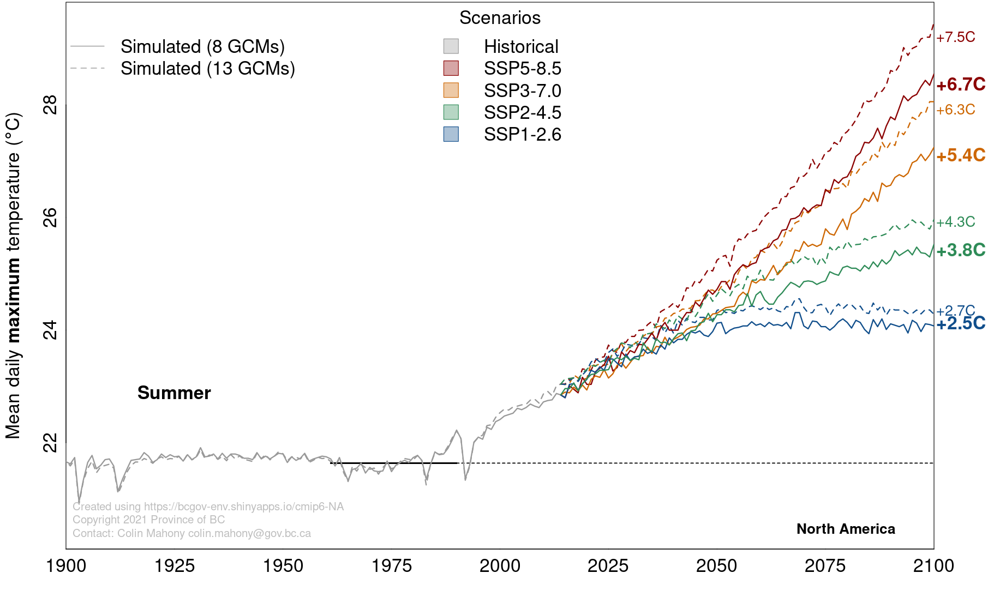
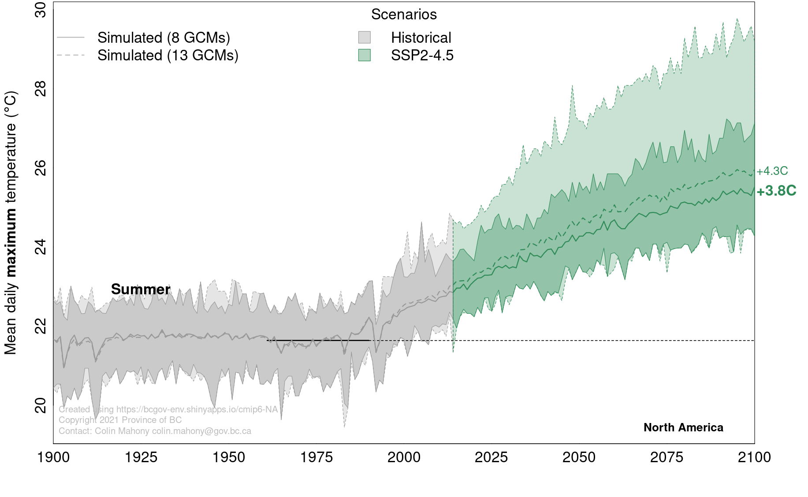

### Selection of the global climate model ensemble

The 13 global climate models available in climr were selected by [Mahony
et al. (2022)](https://doi.org/10.1002/joc.7566) using the following
criteria:

**Criterion 1: Minimum of 3 historical runs available.** This criterion
ensures robust bias correction. Bias correction in climr is performed
using the delta method: in which each model’s simulations are adjusted
to remove the difference (delta factor) between the simulated and
observed climate during the 1961-1990 reference period. Calculating the
delta factor from the mean of at least three simulations reduces the
confounding influence of the internal variability of individual runs on
bias correction. 44 ScenarioMIP models passed this criterion.

**Criterion 2: T~min~ and T~max~ available.** T~min~ and T~max~ are
basic climate variables for `climr`. Any models that do not provide
these variables are incompatible with `climr`. 10 models failed this
criterion. Notably, CESM2 does provide T~min~ and T~max~ in their future
projections, but due to an archiving error these variables are not
available for the historical runs of this model.

**Criterion 3. Complete scenarios.** Models need to have at least one
simulation of each of the four major SSP marker scenarios (SSP1-2.6,
SSP2-4.5, SSP3-7.0, and SSP5-8.5). eight models failed this criterion.

**Criterion 4. One model per institution.** This criterion is a widely
applied best practice in ensemble selection [(Leduc et al.
2016)](https://journals.ametsoc.org/view/journals/clim/29/23/jcli-d-15-0761.1.xml).
The rationale for each selection is provided below.

-   CNRM-ESM2-1 (ECS 4.8^o^C) was chosen over CNRM-CM6-1 (ECS 4.9^o^C) to give preference to
the ESM over the AOGCM configuration; 

-   EC-Earth3 (ECS 4.3^o^C) was
arbitrarily chosen over EC-Earth3-Veg (ECS 4.3^o^C); 

-   INM-CM5-0 (ECS
1.9^o^C) was arbitrarily chosen over INM-CM4-8 (ECS 1.8^o^C);

-   MPI-ESM1-2-HR (ECS 3.0^o^C) was chosen over MPI-ESM1-2-LR (ECS 3.0^o^C)
due to its high resolution and availability of \>1 run for all but
SSP5-8.5.

-   MIROC6 (ECS 2.6^o^C) was chosen over MIROC-ES2L (ECS
2.7^o^C) because it has more runs/scenario, higher resolution, and
because the latter has very high temperature bias over British Columbia.

-   For the purposes of this ensemble, different physics or forcing
schemes were considered different models. We used only the r\*i1p3f1
variants of the GISS-E2-1-G model, as these had the most complete set of
scenario simulations.

**Criterion 5. No closely related models.** Models that share components
were excluded, following Figure 5 of [Brunner et al.
(2020)](https://esd.copernicus.org/articles/11/995/2020/esd-11-995-2020.pdf).
NESM3 was excluded due to its close relation to MPI-ESM1.

**Criterion 6. No large biases.** Bias correction as performed in climr
disrupts the physical connection between climate variables, and these
distortions increase with the size of the biases in the simulation. For
this reason, models with small biases are preferable to models with
large biases, all else being equal. In an assessment over British
Columbia, the AWI-CM-1-1-MR showed extreme temperature biases that
warranted exclusion from the ensemble.

The 13-model ensemble has a mean global equilibrium climate sensitivity
(ECS) of 3.7^o^C and a range of 1.9-5.6^o^C, which matches the full
CMIP6 ensemble ECS (3.7^o^C; 1.8-5.6^o^C, [Meehl et al.
2020](https://advances.sciencemag.org/content/advances/6/26/eaba1981.full.pdf).

### The 8-model ensemble recommended for general purpose

All 13 models provided in climr are valid for analysis relative to
warming levels. However, Mahony et al. (2022) recommended a subset of 8
models for ensemble analysis, based on the following four criteria:

**Criterion 7. Constraints on equilibrium climate sensitivity (ECS).**
Multiple lines of evidence indicate that the Earth’s equilibrium climate
sensitivity (ECS) is very likely between 2^o^C and 5^o^C (Hausfather et
al. 2022). The evidence for the lower bound is robust, and weaker for
the upper bound. From one perspective, inclusion of models with ECS
outside this range uneccessarily increases the modeling uncertainty in
downstream analyses. The opposing perspective is that high-sensitivity
models are useful as a representation of high-impact, low-likelihood
scenarios ([Sutton and Hawkins
2020](https://esd.copernicus.org/articles/11/751/2020/)). Both
perspectives are valid, and the preference depends on the objectives of
each analysis.

**Criterion 8. Model resolution.** Four of the climr models are high
enough resolution to resolve macrotopography e.g., to clearly
differentiate the coast mountains from the Columbia/Rocky Mountains.
This resolved macrotopography does produce elevation-dependent climate
change signals and rainshadow effects. These models are weighted towards
inclusion despite other criteria such as a low number of simulations per
scenario. Conversely, models with very low resolution are weighted
towards exclusion.

**Criterion 9. Number of simulation runs.** climr is primarily designed
for analysis of projected climate normals; the climate change signal is
of primary interest. Internal variability of the models are a
confounding factor, producing erratic climate change trajectories in
noisy climate variables like precipitation and winter temperature. The
signal-to-noise ratio is increased by averaging the projected normals
over multiple simulations of the same emissions scenario. Four models
(BCC, INM, GFDL, and MRI) have only one run for most of the four
scenarios, and this is a consideration for their exclusion.

**Criterion 10: Spatial pattern.** IPSL-CM6A-LR has a pronounced pattern
of localized summer heating along the BC coast ranges, and little
warming in some adjacent cells. This pattern is present for both T~min~
and T~max~ for all summer months. This may be a physically credible
response within the model context, for example due to a snow albedo
feedback. However, for the purposes of `climr` it would be problematic
to downscale this warming pattern across all elevations within the cell.
This problem is not isolated to IPSL-CM6A-LR, but the cell-to-cell
contrast is especially pronounced in IPSL and could create artefacts for
analyses based on `climr`.

The following models are excluded based on the combination of the four
screening criteria:

1.  CanESM5, because its very low horizontal resolution creates grid-box
    artefacts in downscaling and because its very high climate
    sensitivity (ECS 5.6^o^C) is also represented by UKESM1-0-LL.

2.  INM-CM5-0, because it has very low climate sensitivity (ECS 1.9^o^C)
    and is an outlier among CMIP6 models for under-representing the
    observed 1975-2014 global temperature trend [(Liang et al.
    2020)](https://agupubs.onlinelibrary.wiley.com/doi/epdf/10.1029/2019GL086757).
    In addition, this model has only one simulation for most scenarios,
    producing a less robust climate signal.

3.  BCC-CSM2-MR, due to having a single simulation for each scenario and
    very low topographic resolution.

4.  IPSL-CM6A-LR, due to isolated grid cells with very high summer
    warming in the BC Coast Ranges. The warming in these cells may be
    physically plausible (e.g., due to snow albedo feedbacks) in the
    model's simplified topography, but is problematic for downscaling to
    high spatial resolution in climr.

A fifth model, UKESM1-0-LL, also has very high climate sensitivity,
similar to CanESM5, that is assessed as very unlikely based on
observational evidence. Some researchers may wish to constrain their
analysis ensemble to observations by excluding this model. Others may
wish to include this model in their ensembles as a representation of the
long tail of uncertainty in the upper limit of climate sensitivity
[(Sutton
2018)](https://esd.copernicus.org/articles/9/1155/2018/esd-9-1155-2018.pdf).

The 8-model subset that excludes UKESM1-0 has a mean global ECS of
3.4^o^C (2.6-4.8^o^C).

### Comparison of the 13-model and 8-model ensemble

The differences between the 13-model and 8-model ensembles are
illustrated in Figure 1. For mean summer daily maximum temperature
(tasmax/Tmax_sm) averaged over North America, the 13-model ensemble mean
is 0.5^o^C (13%) warmer than the 8-model ensemble mean. The proportional
differences are greater in higher emissions scenarios (Figure 1, top).
The difference between the ensembles is roughly equal to the difference
between adjacent scenarios in mid-century (2040-2070), but is less
important than differences among scenarios later in the century. This
emphasizes that uncertainty in future emissions overshadows the
differences between the 13-model and 8-model ensemble means.

The range of year-to-year variability is much greater in the 13-model
ensemble (Figure 1, top). This is largely due to the extreme warming
produced at high latitudes by the UKESM1-0 model. While interannual
variability of individual model runs does not affect most users of climr
(since they are averaged out in the climate normals), Figure 1 (bottom)
illustrates the importance of careful ensemble selection in analysis of
climate time series.

 
***Figure 1: Comparison of the ClimateNA 13-model ensemble (dashed
lines) and 8-model ensemble (solid lines)***. *The variable is mean
summer daily maximum temperature (tasmax/Tmax_sm) averaged over North
America. The 8-model ensemble excludes models with ECS outside the
IPCC-assessed 2-5^o^C range. (top) Ensemble mean projections for the
four main CMIP6 marker scenarios. (bottom) Ensemble mean and full range
(min/max for all simulations of all models) for the SSP2-4.5 scenario.*

### Reconciling the equilibrium climate sensitivity of the CMIP6 ensemble with observational constraints (Excerpted from Mahony et al. 2022)

> The 13-model ensemble, like the full CMIP6 ensemble, has a mean
> (3.7^o^C) and upper limit (5.6^o^C) of equilibrium climate sensitivity
> that substantially exceeds the IPCC AR6 assessed best estimate ECS of
> 3^o^C and very likely upper limit of 5^o^C (Arias et al. 2021). In
> other words, the 13-model ensemble contains models that simulate
> stronger global warming than is supported by multiple lines of
> observational evidence. Five (38%) of the 13 models are above the IPCC
> AR6 assessed likely upper limit on ECS of 4^o^C, and two (15%) of the
> models are above the very likely upper limit of 5^o^C. If the ensemble
> were to strictly conform to the IPCC assessed range, there would be
> only two models exceeding 4^o^C ECS and no models exceeding 5^o^C,
> following the IPCC’s probabilistic definitions of likely (one-sided
> p\>83%) and very likely (one-sided p\>95%).\
> \
> The need to reconcile the CMIP ensemble ECS range with observational
> constraints is a new dilemma for climate change impacts and adaptation
> researchers. It is long been agreed that model democracy (one model,
> one vote) is not a strictly valid method of assessing climate change
> uncertainty (Knutti 2010, Leduc et al. 2016). However, prior to CMIP6
> this objection was somewhat academic since the distribution of ECS in
> CMIP ensembles approximately matched the (wider) range of ECS
> supported by other lines of evidence (Schmidt 2021). For practical
> purposes it was reasonable for analysts to use the multimodel ensemble
> spread in previous CMIP generations as a proxy for scientific
> uncertainty on climate change. This approach is no longer valid given
> the incongruence between the CMIP6 ensemble range of ECS and the IPCC
> assessed range (Schmidt 2021). Careful model selection is now required
> to avoid biasing regional climate change analyses.\
> \
> There are several viable approaches to constrain CMIP6 ensembles in
> downscaled regional analyses. Weighting the models based on
> observational constraints is possible for regional analyses (Ribes et
> al. 2021). However, in practice many analyses will require simply
> selecting a subset of the CMIP6 ensemble that is closer to the IPCC
> assessed range, as we have done with the 8-model subset. The
> disadvantage of this approach is that it discards valuable information
> from the excluded models. The CanESM5 and UKESM1 models are advanced
> models from respected modeling centers, with demonstrated skill in
> modeling many Earth system processes (Eyring et al. 2021). Expressing
> variables of interest relative to the amount of regional or global
> warming is a widely practiced technique that facilitates inclusion of
> high-ECS models by removing the timing of the warming as a factor in
> the ensemble spread (Arias et al. 2021). It is conceivable that both
> techniques could be used in a single study; to use the 8-model
> ensemble for time-relevant analyses and a larger ensemble for analyses
> where the warming level is more relevant. These considerations
> highlight that the full CMIP6 ensemble is a somewhat arbitrary
> collection of non-independent models, and careful ensemble selection
> is necessary to achieve a meaningful representation of modeling
> uncertainty.

## References

Arias, P. A., N. Bellouin, E. Coppola, et al. 2021. Technical Summary.
Pages TS1-150 in V. Masson-Delmotte, P. Zhai, A. Pirani, et al.,
editors. Climate Change 2021: The Physical Science Basis. Contribution
of Working Group I to the Sixth Assessment Report of the
Intergovernmental Panel on Climate Change. Cambridge University Press.

Eyring, V., N. P. Gillett, K. M. A. Rao, et al. 2021. Human influence on
the climate system. Pages 1–202 in V. Masson-Delmotte, P. Zhai, A.
Pirani, et al., editors. Climate Change 2021: The Physical Science
Basis. Contribution of Working Group I to the Sixth Assessment Report of
the Intergovernmental Panel on Climate Change. Cambridge University
Press.

Mahony, C.R., T. Wang, A. Hamann, and A.J. Cannon. 2022. [A global
climate model ensemble for downscaled monthly climate normals over North
America](https://rmets.onlinelibrary.wiley.com/doi/full/10.1002/joc.7566).
International Journal of Climatology. 42:5871-5891.
[doi.org/10.1002/joc.7566](https://doi.org/10.1002/joc.7566)

Hausfather, Z., K. Marvel, G. A. Schmidt, J. W. Nielsen-Gammon, and M.
Zelinka. 2022. [Climate simulations: recognize the “hot model”
problem](https://bookcafe.yuntsg.com/ueditor/jsp/upload/file/20220518/1652835870524078994.pdf).
Nature 605:26–29.

Knutti, R. 2010. The end of model democracy? Climatic Change
102:395–404. Leduc, M., R. Laprise, R. de Elia, and L. Separovic. 2016.
Is Institutional Democracy a Good Proxy for Model Independence? Journal
of Climate 29:8301–8316.

Ribes, A., S. Qasmi, and N. P. Gillett. 2021. Making climate projections
conditional on historical observations. Science Advances 7:1–10.

Schmidt, G.A. 2021. #NotAllModels. RealClimate. Available from:
<https://www.realclimate.org/index.php/archives/2021/08/notallmodels/>
[Accessed 4th January 2022]
