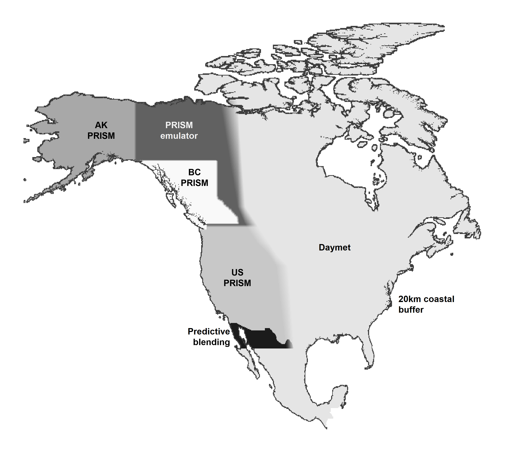
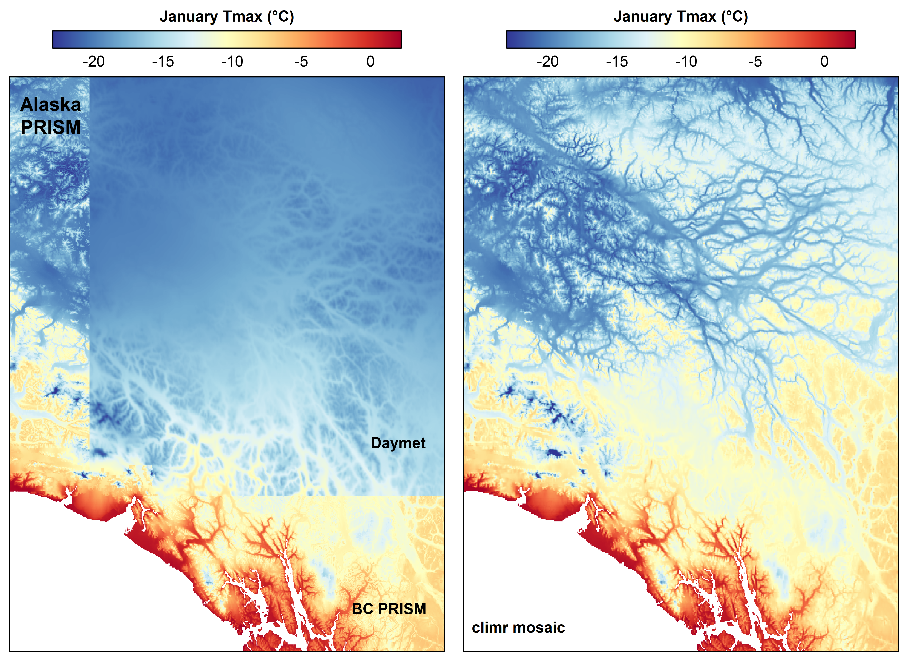
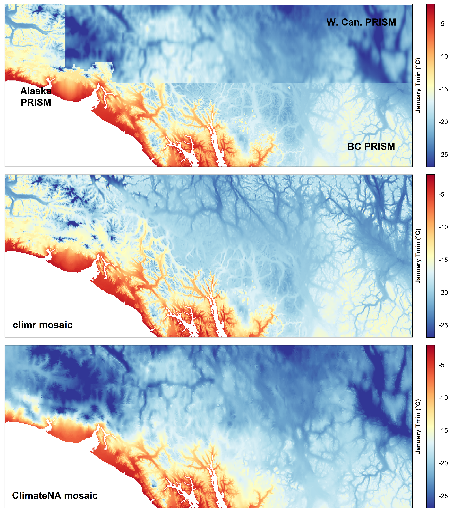
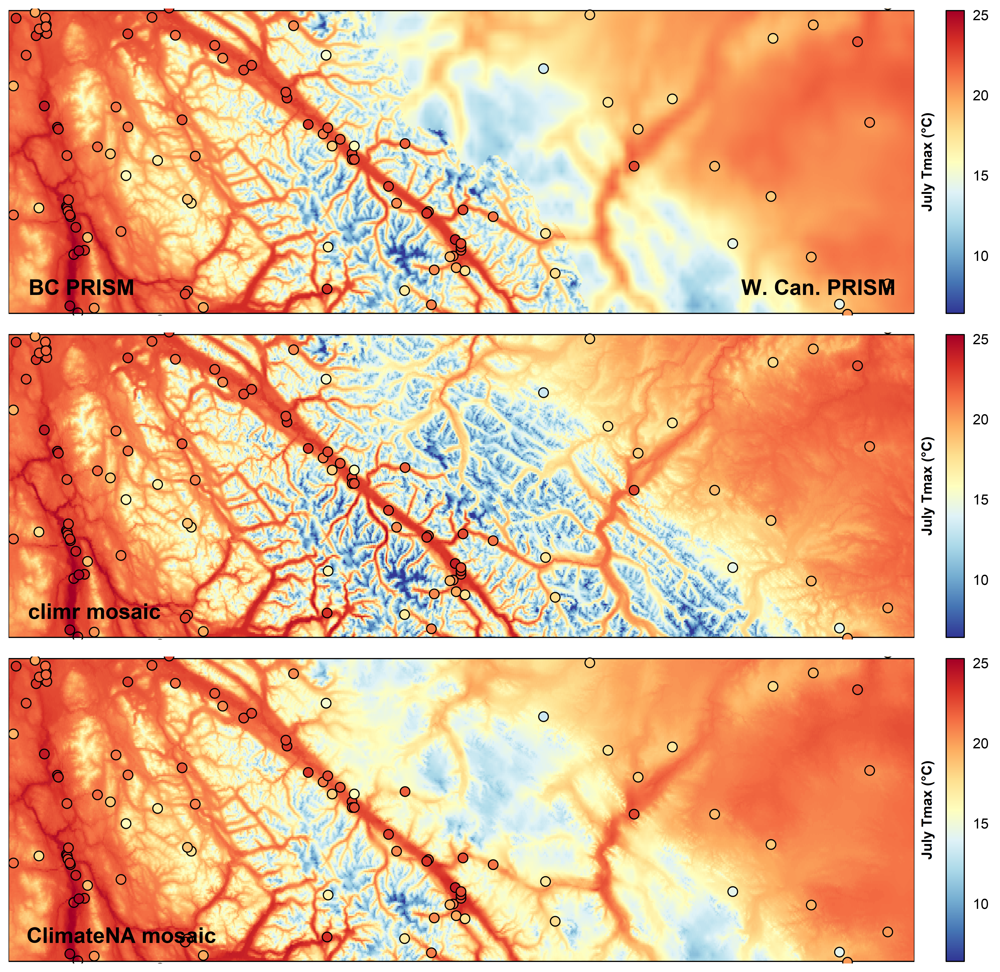
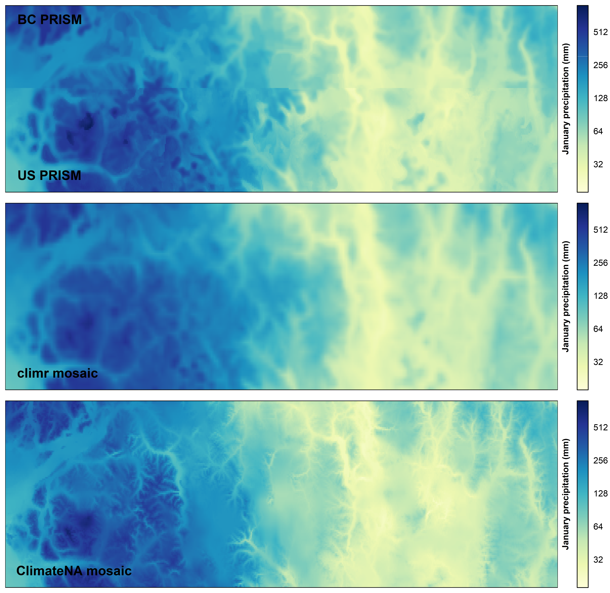
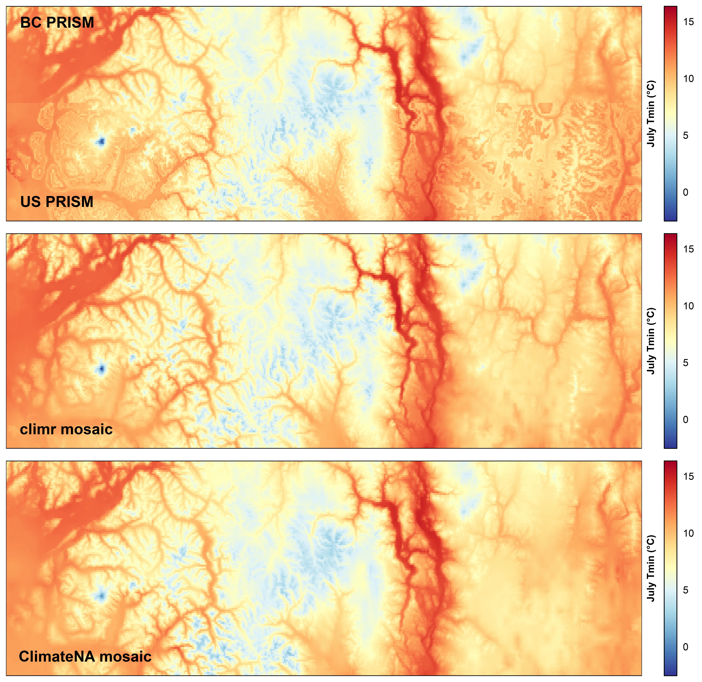
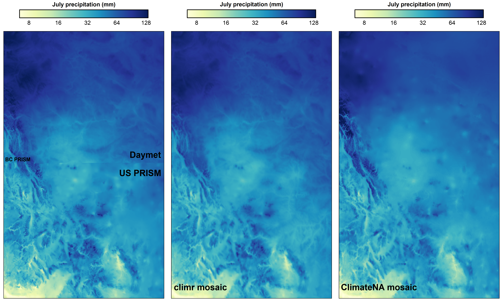
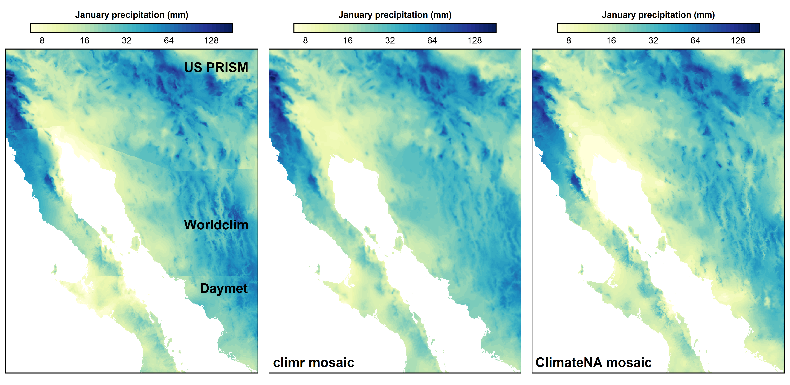
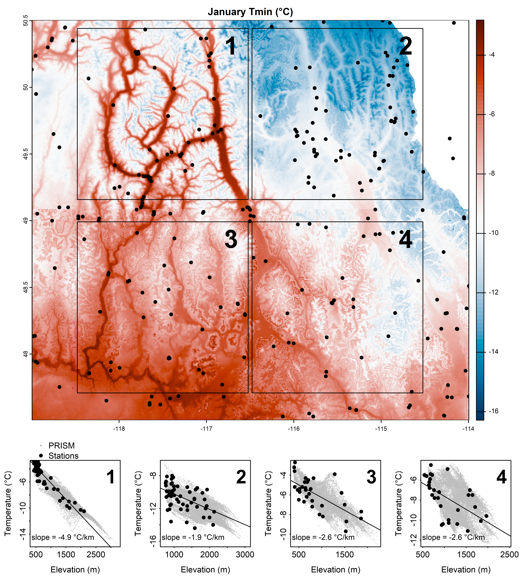
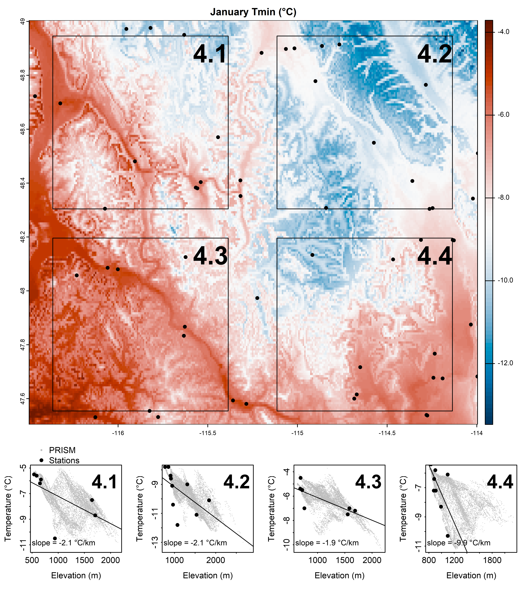

```{r, echo=FALSE, fig.cap = "", results='asis', out.width = "100%"}
knitr::include_graphics("plots_mosaic/climr_mosaic_1981_2010_Tmax07.png")
```


## Introduction

## Methods

The climr mosaic is a composite of the 1981-2010 gridded climate maps from the following sources ([Figure 1](#fig1)): 

- **PRISM for Western US**---The Parameter-elevation Regressions on Independent Slopes Model (PRISM; @daly2008) maps are recognized as the highest-quality gridded climatological normals for the contiguous United States. We blended the US PRISM with BC PRISM emulator between latitudes 48^o^N and 49^o^N.

- **British Columbia PRISM**---The BC PRISM (@pcic2014) is developed by the [Pacific Climate Impacts Consortium](pacificclimate.org/data/prism-climatology-and-monthly-timeseries) in collaboration with the PRISM Climate Group (Oregon State University). It generally is highly compatible with the US and Alaska PRISM products, with exceptions noted in the [Discussion section](#apparent-tmin-artefacts-in-the-us-prism). The blending with the PRISM emulator along the northern, eastern, and southern BC boundary does not compromise the integrity of the BC PRISM since the emulator replicates the PRISM map in the blending region. 

- **Alaska PRISM**---The PRISM 1981-2010 climatological maps for Alaska [(Daly et al. 2018)](https://prism.oregonstate.edu/projects/public/alaska/report/ak_final_report_8110.pdf) are the best available product, as a result of exhaustive station data compilation and local expert review.

- **Daymet for eastern North America and Mexico**---While the US PRISM is likely preferable to Daymet over the continental US, Daymet (@thornton2021) provides north-south continuity across Canada, USA, and Mexico. Daymet was chosen over other North American gridded climatologies (WorldClim and CHELSA) due to its relative quality and the availability of a 1981-2010 normal period.

- **PRISM Emulator in Yukon and Northwest Territories**---We evaluated all available climatological maps for the Yukon and Northwest Territories (WorldClim, CHELSA, Daymet, NRCAN ANUSPLIN, and Western Canadian 4km 1981-2010 PRISM). None of these products were of acceptable quality due to very low weather station density. To provide a PRISM-compatible estimation of climate in this region, we trained deep learning models on the BC and Alaska PRISM maps and predicted them into the Yukon and NWT. This method is described in more detail [below](#prism-emulator-for-the-yukon-and-northwest-territories). 

- **Predictive blending in Northern Mexico**---The US PRISM and Daymet maps require blending at the US-mexico border to avoid boundary artefacts. Rather than blending Daymet into the US PRISM, which would degrade the PRISM map, we used machine learning (Random Forest regression) to interpolate between PRISM and Daymet in a broad swath of Northern Mexico. This is a less sophisticated approach to PRISM emulation than used in the Yukon and NWT, but it is much more computationally efficient and produced acceptable results. This method is described in more detail [below](#predictive-blending-for-northern-mexico). 

- **20km Coastal buffer**---We extended the coastal climate values outwards into the ocean to a distance of 20km from shore. We retained existing coastal buffers present in the PRISM products and extended their outer limit where necessary. This buffer ensures climate values are available in outer coastal land areas, but is not intended to estimate temperature and precipitation over the ocean. 

<div id="fig1">
```{r, echo=FALSE, fig.cap = "Figure 1. Elements of the climr mosaic of 1981-2010 climatologies. PRISM and Daymet are publicly available datasets. The PRISM Emulator and predictive blending were developed as part of the climr mosaic method and are described in this article. Blending between products is as shown. ", results='asis', out.width = "100%"}

```
</div> 

### PRISM emulator for the Yukon and Northwest Territories

Generative Adversarial Networks (GANs; @goodfellow2014) are a deep learning technique originally developed for computer vision that has recently been applied to downscaling hourly weather simulations. While this approach has not been applied to climate mapping, it is appealing for this application because of its ability to make predictions of spatial patterns, rather than just point estimates. In this way, GANs can be used to emulate the spatial structures of a climatological mapping technique such as PRISM and thus provide a more seamless extrapolation of PRISM mapping into unmapped regions. While GAN-predicted climatologies are not a substitute for supervised climatological maps such as PRISM, they provide an interim solution where acceptable climate maps have not been developed, as in the Yukon and Northwest Territories. 

We used a stochastic implementation of GANs (@daust2024) to interpolate between the Alaska/BC PRISM maps and the Daymet maps east of longitude 112^o^E. One GAN model was created for each climate variable (e.g., January precipitation). The PRISM and Daymet maps for the target variable were combined into a predictand layer. As predictors, we used the WorldClim (@fick2017) climatology for the target variable as well as latitude, longitude, elevation, and coastal proximity. We ran each GAN to 150 epochs (training iterations), as trials indicated that further epochs were generally not warranted. We created three stochastic models for the months of March, June, September, and December as a means of mapping prediction uncertainty. Our models of precipitation exhibited artefacts along the arctic coast that required local substitution with a random forest prediction. 

Evaluation and refinement of the PRISM emulator method is ongoing. It would likely be preferable to use weather model simulations (such as ERA5 and/or the Weather Research and Forecasting (WRF) model) as predictor variables rather than WorldClim, which likely confounds training due to spatially inconsistent climate mapping. Further, we intend to produce multiple realizations of all months (not just four) to provide comprehensive uncertainty mapping. Finally, we need to resolve the artefacts in predicted precipitation along the arctic coast. 

### Predictive blending for northern Mexico

The objective of predictive blending was to produce a seamless transition from the US PRISM to Daymet south of the US Border, to avoid compromising the integrity of the US PRISM. We trained one Random Forest (@breiman2001) regression model for each variable. The US PRISM south of 35^o^N and Daymet between 25-28^o^N were combined into a predictand layer. As predictors for each variable, we used the Daymet and WorldClim (@fick2017) climatologies for Tmin, Tmax, and precipitation of the target month and the two adjacent months (i.e., Jan-Feb-Mar for the target month of February); using multivariate climate predictors allowed the exclusion of latitude and longitude as predictors, which caused prediction artefacts during trials. Daymet contains precipitation artefacts on the Baja peninsula; for this small region we trained a separate model to blend PRISM precipitation into WorldClim precipitation. 

### Grid resolution

We aggregated the BC PRISM 30-arcsecond (approx 800m) grid to 90-arcsecond (approx. 2.5km) resolution and extended this grid to North America. All other products were resampled to this grid using bilinear interpolation. The 2.5km grid scale reduces downloading and storage by a factor of 9, while retaining sufficient information for the original PRISM and Daymet temperature maps to be recreated at 800m and finer resolutions through climr's elevation adjustment with inferred lapse rates. `climr` does not apply an elevation adjustment to precipitation, and as a result the spatial pattern of PRISM precipitation is slightly degraded at this coarser resolution (see [Figure 4](#fig4). We are assessing whether the finer-resolution details of PRISM precipitation are warranted. 

## Results

This section provides a brief illustration of the climr mosaic in case study regions. ClimateNA output, sourced from a direct query to ClimateNA (@wang2016), is provided for comparison since the ClimateNA mosaic is available in `climr` as an alternative reference climatology. 

### Yukon Territory

[Figure 2 (left panel)](#fig2) illustrates the challenge of combining climate maps made using different methodologies (i.e., PRISM vs Daymet) in a region of very low station density. While Daymet and PRISM have similar January temperatures (Tmax) at low elevations where weather stations are located, they have opposite lapse rates resulting in divergent temperatures at higher elevations (Daymet colder and PRISM warmer). In addition, the automated lapse rate calculation in Daymet produces regions of no elevational variation in temperature. In short, Daymet and PRISM are incompatible; blending them would degrade PRISM in the blending zones and create a discontinuity in the mosaic that would confound downstream analysis. In contrast, the GAN prediction (PRISM emulator) produces a visually credible interpolation of the BC and Alaska PRISM maps [Figure 2 (right panel)](#fig2). We have not yet conducted a quantitative evaluation of the GAN predictions relative to station data and other observational evidence. 

<div id="fig2">
```{r, echo=FALSE, fig.cap = "Figure 2. Source data and prediction of the PRISM emulator for January Tmax (i.e., monthly mean daily maximum temperature) in southwest Yukon.", results='asis', out.width = "100%"}

```
</div> 

[Figure 3](#fig3) provides further perspective on the PRISM emulator relative to other data sources, using January Tmin as an example. The ClimateNA mosaic (bottom panel) uses a blend of the BC PRISM with a legacy 1961-1990 4km Western Canadian PRISM for the Yukon. This degrades the BC PRISM in the 50km overlap region of northern BC and the differences in the two datasets confound cross-border analysis. The PRISM emulator (centre panel) produces a preferable mosaic, but it is not ideal. The centre of the image exhibits an abrupt, dubious transition from negative lapse rates (warm valleys, cold mountains) in BC to positive (inverted) lapse rates in the Yukon. This demonstrates the need for a more sophisticated PRISM emulation method. Further, it emphasizes that the PRISM emulator is not a substitute for the PRISM methodology. 

<div id="fig3">
```{r, echo=FALSE, fig.cap = "Figure 3. Comparison of climr and ClimateNA mosaics to source data for January Tmin in southwest Yukon.", results='asis', out.width = "100%"}

```
</div> 

### BC-Alberta border

[Figure 4](#fig4) shows the results of the PRISM emulator along the BC-Alberta border at latitude 52-54.5^o^N. As in the Yukon, the PRISM emulator provides a credible extrapolation outside the BC border, avoding the need to blend an inferior map into the BC PRISM domain. Notably, ClimateNA is not able to recover spatial resolution through elevation adjustment, and the climatology of the Rocky Mountains is degraded as a result. The weather stations demonstrate the challenge of climate mapping in this region: Weather stations are exclusively at low elevations, providing little support for automatic lapse rate calculation used by WorldClim and Daymet. This emphasizes the necessity for expert-supervised climatological mapping methods such as PRISM. 

<div id="fig4">
```{r, echo=FALSE, fig.cap = "Figure 4. Comparison of climr and ClimateNA mosaics to source data for July Tmax at the continental divide boundary of southern BC and Alberta. Filled circles are weather stations with 1981-2010 normals following the same colour scheme.", results='asis', out.width = "100%"}

```
</div> 

### BC-US border

The BC and US PRISM products are highly compatible for precipitation and Tmax, and generally result in a seamless transition at the 49th parallel [Figure 5](#fig5). Since precipitation is not elevation-adjusted by default in climr, aggregating the climr mosaic to 2.5km resolution results in a blurring of the PRISM precipitation map (Figure 5, center panel). We are not aware of observational or theoretical evidence to support precipitation gradients at less than 3km resolution in BC, except in dry valleys where virga (evaporation of precipitation as it falls) could contribute to elevational gradients in precipitation. As a result, this blurring in the climr mosaic likely is generally acceptable. ClimateNA does apply elevation adjustment to precipitation, as shown in the bottom panel of Figure 5, which results in some valleys being drier than the original PRISM product. The climr `downscale()` function provides an option for elevation adjustment of precipitation (`ppt_lr = TRUE`).  

<div id="fig5">
```{r, echo=FALSE, fig.cap = "Figure 5. Comparison of climr and ClimateNA mosaics to source data for January precipitation along the boundary of southern BC and Washington State.", results='asis', out.width = "100%"}

```
</div> 

The BC and US PRISM products are significantly different for Tmin, as shown in [Figure 6](#fig6) (top panel) for January Tmin. The BC PRISM generally exhibits straightforward negative lapse rates (warm valleys, cold mountaintops), while the US PRISM exhibits complex elevational temperature gradients (warm-cool-warm-cool with elevation) in eastern and western portions of the image. This is likely an unintended artefact of the two-layer atmosphere technique employed in the US PRISM as a way of modeling valley inversions (cold valleys, warm midslopes, cold mountaintops). We investigate the evidence for the US PRISM Tmin gradients in a [separate section](#apparent-tmin-artefacts-in-the-us-prism) of this article. We did not find compelling evidence for these gradients based on station data, but are following up with the developers of the US PRISM. 

Assuming that the US PRISM Tmin gradients are an artefact, some reduction in their prominence is desirable, and will contribute to more coherence between the BC and US components of the climr mosaic. Two aspects of the mosaic method contribute to a dampening of the Tmin gradients. First, the PRISM emulator was used to blend the BC and US PRISM between 48^o^N and 49^o^N. Second, the aggregation of the mosaic from 800m PRISM resolution to 2.5km resolution smooths the sharp gradient reversals. The recalculation of the climr mosaic at 800m resolution removes the gradient reversals, but does result in some regions with very low lapse rates (Figure 6, centre panel). These effects are also evident in the ClimateNA mosaic (Figure 6, bottom panel) but the 4km resolution of the ClimateNA mosaic results in removal of non-artefactual features, such as the Columbia River valley and its tributaries at the far right of the image. 


<div id="fig6">
```{r, echo=FALSE, fig.cap = "Figure 6. Comparison of climr and ClimateNA mosaics to source data for July Tmin along the boundary of southern BC and Washington State.", results='asis', out.width = "100%"}

```
</div> 


### Alberta-US border

<div id="fig7">
```{r, echo=FALSE, fig.cap = "Figure 7. Comparison of climr and ClimateNA mosaics to source data for July Precipitation along the Alberta-US boundary.", results='asis', out.width = "100%"}

```
</div> 


### US-Mexico border

<div id="fig8">
```{r, echo=FALSE, fig.cap = "Figure 8. Comparison of climr and ClimateNA mosaics to source data for January Precipitation along the US-Mexico boundary.", results='asis', out.width = "100%"}

```
</div> 


## Discussion and known Issues


### Apparent Tmin artefacts in the US PRISM

<div id="fig9">
```{r, echo=FALSE, fig.cap = "Figure 9. Evaluation of January Tmin lapse rates in the BC PRISM (areas 1 & 2) and US PRISM (areas 3 and 4). Black dots on the map are weather station locations. Bottom panels show the relationship of temperature to elevation in the PRISM grid cells (grey dots) and stations (black dots) within each of the four numbered square areas on the map. The lapse rate provided is a linear best fit to the station data.", results='asis', out.width = "100%"}

```
</div> 


<div id="fig10">
```{r, echo=FALSE, fig.cap = "Figure 10. As in Figure above, but zoomed in on the US PRISM in Area 4, located primarily in Montana State.", results='asis', out.width = "100%"}

```
</div> 

### Extrapolation uncertainty in the PRISM emulator


## References
