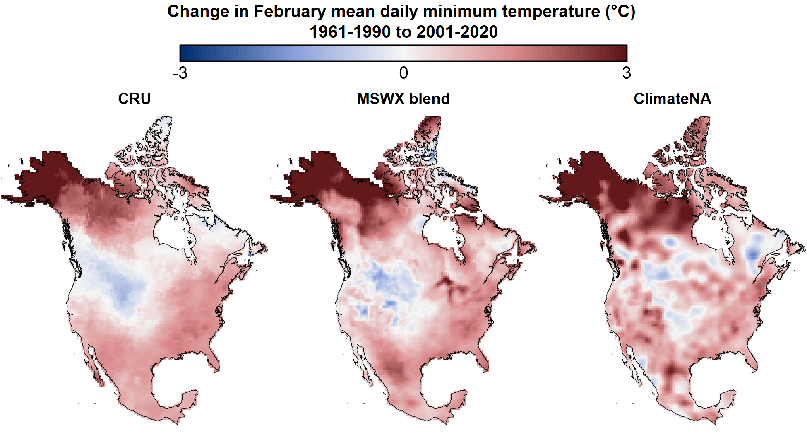
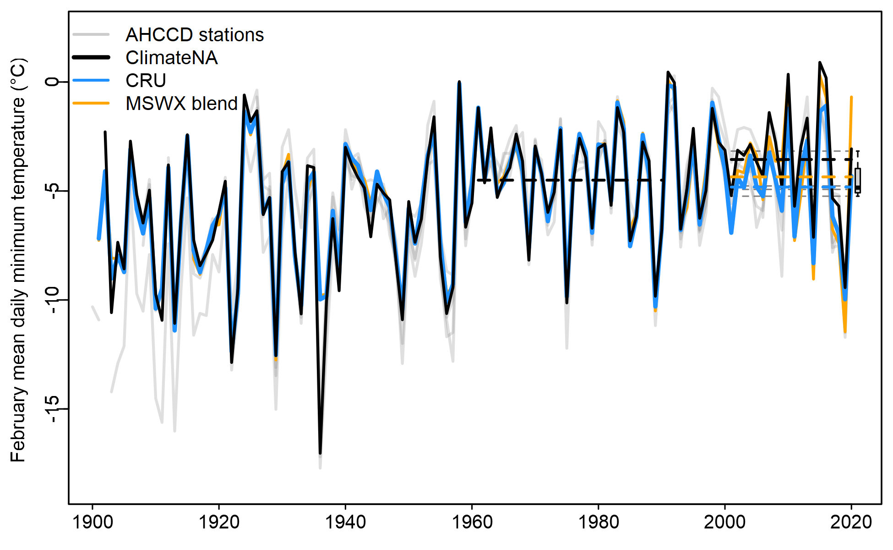

A gridded observational time series is a dataset that organizes real-world measurements into a regular latitude-longitude grid and tracks changes over time. Observations from sources like weather stations and satellites are collected and assigned to these grid cells, using interpolation for grid cells that do not have a direct observation. For each grid cell, the dataset provides a continuous record of a variable — such as temperature or precipitation — over regular time intervals, like daily, monthly, or yearly steps. This structure allows researchers to analyze both spatial patterns and temporal trends across large areas, even in locations without direct observations. 

`climr` provides access to three observational time series datasets of temperature and precipitation: 

1.	`cru.gpcc`: The 1901-2023 combined Climatic Research Unit TS dataset (CRU; @ harris2020cruts) for temperature and Global Precipitation Climatology Centre dataset (GPCC; becker2013gpcc) for precipitation; 
2.	`mswx.blend`: The 1981-2024 Multi-Source Weather (MSWX; @ beck2022mswx) for temperature and Multi-Source Weighted-Ensemble Precipitation (MSWEP; @ beck2019mswep) for precipitation, which we have extended back to 1901 using the CRU/GPCC dataset; and 
3.	`climatena`: The 1901-2023 ClimateNA time series (@wang2024monthly). 

Our aim in this article is provide a better understanding of these datasets, including their strengths and weaknesses. 

### Why are multiple observational datasets necessary? 

Observations of historical weather are limited to data from climate stations, which are very sparse in many areas of North America, and modeled reconstructions (“reanalysis”) of historical weather systems, which have multiple sources of bias. As a result, there is considerable uncertainty about the past weather, and this uncertainty varies across the landscape depending on proximity to where observations were made. By analyzing multiple datasets with different methods and input data, we can better understand the uncertainties in our variables and locations of interest. Further, each dataset may be optimal for different applications. Finally, providing multiple datasets allows `climr` output to be benchmarked against other studies that are based on those products. 

### Dataset descriptions

#### CRU/GPCC

The Climatic Research Unit TS dataset uses angular distance weighting to interpolate monthly weather station anomalies (deviations from a long-term average). It is the only global gridded station time series product that provides monthly mean minimum and maximum daily temperature (Tmin and Tmax) for the entire 20th century. As a result, it is very widely used in climate research. While CRU provides precipitation data, independent research (@sun2018review) and our own analysis indicate that GPCC has higher performance in representing historical precipitation. A significant weakness of both the CRU and GPCC time series dataset is a dramatic decline in the number of stations contributing to the dataset at the end of the 1990s ([Figure 1](#fig1)). 

<div id="fig1">
```{r, echo=FALSE, fig.cap = "Figure 1: Changes in the number of stations contributing to the CRU gridded minimum and maximum temperature products (a) and the GPCC precipitation product (b).", results='asis', out.width = "100%"}
knitr::include_graphics("plots_timeseries/StationCounts_CRU.png")
```
</div>

#### ClimateNA

The 21st century station sparsity of the CRU and GPCC datasets ([Figure 1](#fig1)) motivated the development of the ClimateNA gridded monthly historical time series for North America (@wang2024monthly). This product uses thin-plate splines to interpolate between weather station observations. The station density from 1961-present is maintained at above n=6000 for temperature and n=8000 for precipitation. 

#### MSWX blend

MSWX provides an entirely different approach to gridded observational time series. Instead of interpolating between weather stations, it applies bias correction to the hourly ERA5 reanalysis (i.e., an observationally constrained weather model simulation) for the period 1979-present. The bias correction is performed using monthly climatologies (30-year averages) obtained from the CHELSA product. For precipitation, we use MSWEP, which merges multiple data sources including rain guage, satellite, reanalysis, and river discharge data. We blended the MSWX/MSWEP time series with the CRU/GPCC time series to produce a 1901-2024 time series and to allow calculation of MSWX anomalies relative to the 1961-1990 baseline used in climr. The blend occurs in the 1990s; hence the `mswx_blend` product is CRU/GPCC prior to 1990, MSWX/MSWEP post-1997, and a weighted average from 1990-1997. 

### Intercomparison of datasets

The three datasets have distinct spatial patterns of anomalies; exemplified by their 2001-2020 average Tmin anomalies across North America ([Figure 2](#fig2)). CRU anomalies vary at large spatial scales due to the broad spatial influence of each station in the distance weighting method.  In contrast, the MSWX blend exhibits localized anomalies that follow physiographic features such as the MacKenzie Mountains in southern Yukon, the Great Lakes, and the coastal fringe in the Pacific Northwest. This link to physiographic features is an outcome of using a physical weather model as the basis for MSWX. Finally, the ClimateNA time series exhibits credible spatial detail in station-dense United States, but also has spatial oscillations in station-sparse western and northern Canada that may be artefacts of the thin-plate spline method of interpolation between stations. 

<div id="fig2">
```{r, echo=FALSE, fig.cap = "Figure 2: Comparison of the CRU, MSWX-blend, and ClimateNA gridded time series in terms of the difference between the 1961-1990 and 2001-2020 average February Tmin.", results='asis', out.width = "100%"}

```
</div>

[Figure 3](#fig3) provides 

<div id="fig3">
```{r, echo=FALSE, fig.cap = "Figure 3: As in Figure 2, but for Tmax and precipitation of January, April, July, and October.", results='asis', out.width = "100%"}
knitr::include_graphics("plots_timeseries/CRUvsMSWX_Diffplots.png")
```
</div>


<div id="fig4">
```{r, echo=FALSE, fig.cap = "Figure 4: As in figure 2, but zoomed into the region of BC and Alberta. The black rectangle at lower centre of each map is a region of the Okanagan Valley featured in Figures 5 and 6. ", results='asis', out.width = "100%"}
knitr::include_graphics("plots_timeseries/CRUvsMSWXvsClimateNA_BCAB.Tmin.02.png")
```
</div>


<div id="fig5">
```{r, echo=FALSE, fig.cap = "Figure 5: Comparison of the ClimateNA and CRU February Tmin time series for the Okanagan Valley study area mapped in Figure 5. Solid grey lines are the station records for the six AHCCD stations located in the study area. Dashed lines are the 2001-2020 mean of each time series. The boxplot shows the distribution of the AHCCD station 2001-2020 means.", results='asis', out.width = "100%"}

```
</div>


<div id="fig6">
```{r, echo=FALSE, fig.cap = "Figure 6: As in Figure 5, but for July Tmin. ", results='asis', out.width = "100%"}

```
</div>


<div id="fig7">
```{r, echo=FALSE, fig.cap = "Figure 7: Error (relative to AHCCD stations) in 2001-2020 average anomaly from the 1961-1990 baseline, for monthly mean of daily minimum and maximum temperature. The study area is western Canada, west of -100^o^E. Each box-and-whisker plot shows the minimum, 25th percentile, median, 75th percentile, and maximum of the distribution.", results='asis', out.width = "100%"}
knitr::include_graphics("plots_timeseries/Boxplots_AHCCD_Wcan.png")
```
</div>


<div id="fig8">
```{r, echo=FALSE, fig.cap = "Figure 8: As in Figure 7, but Tmin error of (a) British Columbia, (b) Alberta, and (c) Saskatchewan. ", results='asis', out.width = "100%"}
knitr::include_graphics("plots_timeseries/Boxplots_AHCCD_provinces.Tmin.png")
```
</div>


### Conclusions
-	All three gridded datasets have potential drawbacks. 
-	None are reliable for detection of climate change trends, for which quality-controlled station data such as the AHCCD product (@vincent2020ahccd) are preferable. We intend to provide access to AHCCD data in future versions of `climr`. 
- we have not yet done sufficient QA to recommend one dataset for general purpose. 
- we are using the MSWX-blend for the 2001-2020 period, and for transfer anomalies. 
- reanalysis products will tend to do worse in station validation becasue they are based on independent data. however, they can be expected to do better in areas with no stations. 

### References

